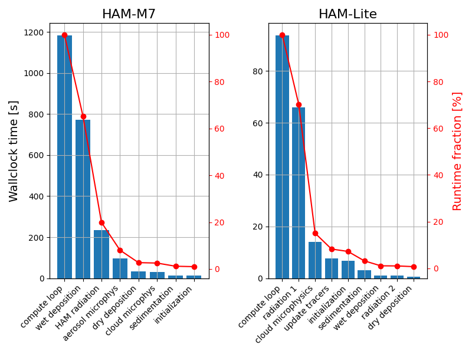
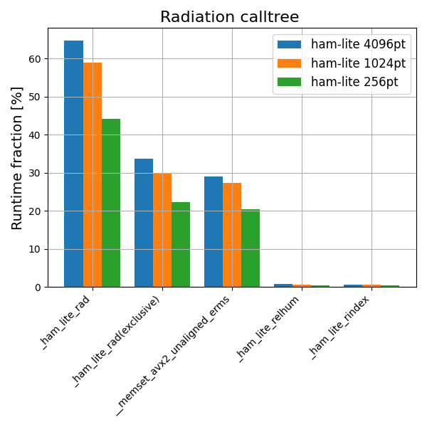

# Baseline performance profiling of the Aerosol DTC

## 1. Introduction

The Aerosol DTC in TerraDT will be based on the HAM-Lite aerosol module, which is a reduced-complexity version of HAM-M7. In this baseline analysis, a stand-alone box model configuration of HAM-Lite was analysed. In these runs, HAM-Lite was used in a "3d" mode, ingesting atmospheric conditions from a sample climate model output data, where the model internal procedures loop through the input data grid. 

The model souce code was obtained from [here](https://github.com/HOR-INFRAEU-TerraDT/hamlite_box). This was the initial version of the code provided by FMI -- unfortunately, clear version
numbers/release tags were not yet incorporated at the time of writing this document.

For comparison purposes, the the basic profiling data was also generated for the full HAM-M7 found [here](https://github.com/HOR-INFRAEU-TerraDT/hambox).

## 2. Environment
HAM-Lite was built and run on the LUMI supercomputer with the LUMI/25.03 software stack. The model was initially configured to build with the GNU Fortran compiler. Therefore, GNU Fortran version 14.3.0 was used in these experiments. The compilers flags used were `-cpp -finit-real=zero -finit-integer=0 -O2`.

In addition, the HAM-M7 was built with similar settings, with compiler flags as `-cpp -std=legacy -O2 -DNOMPI -D__x86_64`.

The exact environment for HAM-Lite is defined by [HAM-Lite_LUMI_gfortran_env_build_perftools.sh](scripts/HAM-Lite_LUMI_gfortran_env_build_perftools.sh). For HAM-M7 the environment is practically identical with the exception of using makedep90 for Makefile generation.

## 3. Methodology
HAM-Lite was run in a "3d" mode, with internal loop structures processing through the input data grid. In the basic setup, we used data with 137 vertical levels and 4096 lateral grid points. Additional sensitivity tests were run with 1024 and 256 lateral grid points. The timing statistics were derived from source code instrumentation implemented using Fortran intrinsic routines. Additional statistics were obtained using Cray Performance Analysis Tools. Specifically, we use the module perftools-lite sampling experiments to generate calltree statistics. 

Similar steps were followed with HAM-M7.

## 4. Results

Figure 1 shows the basic HAM-Lite and HAM-M7 profiles, timed for each main subroutine and the full compute loop.

As expected, HAM-Lite is about an order faster compared to HAM-M7 in similar configuration. By far the most expensive subprogram in HAM-Lite is the calculation of particle radiative
properties.

Profiling with CrayPat shows new details: about half of the radiation submodel run time is consumed by memory access processes, suggested by the calls to `memset_avx2_unaligned_erms` and related procedures handled by the compiler. This is clearly observed in Figure 2. In fact, this takes up to 20-30% of the entire model execution time. Superficial inspection of the source code reveals frequent array allocations and initializations within the radiation submodel, which are therefore a very promising opportunity for future optimizations. The CrayPAT sampling data as well as the basic model profiles are found in 

